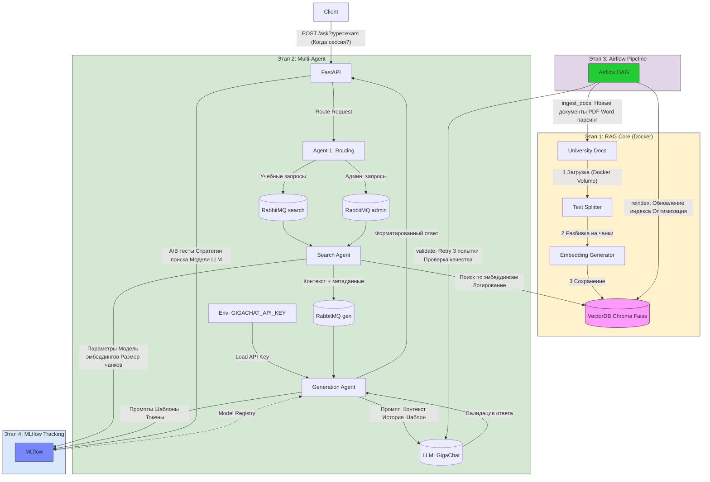

# Assistant for UN
Система реализует мультиагентную архитектуру для обработки запросов студентов по учебным и административным вопросам. Она включает:

Этап обработки университетских документов (RAG-система)

Обработку запросов через мультиагентную систему

Планирование и автоматизацию обновления данных через Airflow

Мониторинг и трекинг через MLflow

