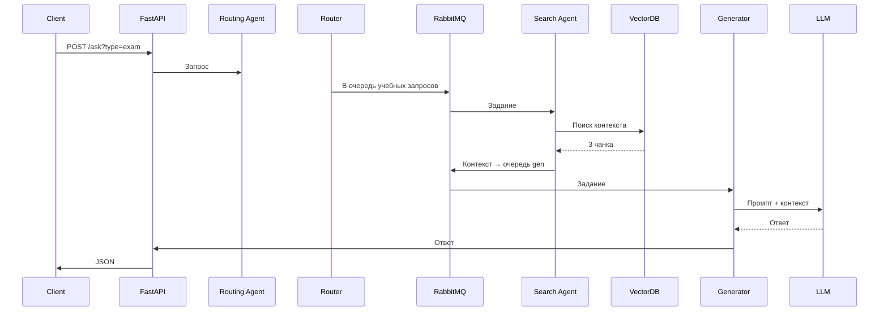

# Assistant
Система реализует мультиагентную архитектуру для обработки запросов студентов по учебным и административным вопросам. Она включает:

Этап обработки университетских документов (RAG-система)

Обработку запросов через мультиагентную систему

Планирование и автоматизацию обновления данных через Airflow

Мониторинг и трекинг через MLflow

## Полный цикл обработки запроса

## Этап 1: RAG-система 

### University Docs → Text Splitter
Университетские документы (PDF, Word) монтируются внутрь контейнера через Docker volume.
Это могут быть расписания, регламенты, инструкции и другие официальные документы.

### Text Splitter → Embedding Generator
Документы разбиваются на смысловые фрагменты (чанки), пригодные для векторизации.
Применяется логика нарезки по абзацам, предложениям или по токенам.

### Embedding Generator → VectorDB
Генератор эмбеддингов преобразует каждый чанк в вектор с использованием предобученной модели (например, sentence-transformers).
Вектора сохраняются в базу данных (Chroma или Faiss), где они индексируются по смыслу и метаданным

## Этап 2: Мультиагентная архитектура
### Client → FastAPI
Студент отправляет запрос в веб-интерфейс (например, "Когда сессия?")
HTTP-запрос содержит параметр type=exam, по которому будет определяться категория.

### FastAPI → Routing Agent
API передаёт запрос агенту маршрутизации.
Агент 1 (Routing) анализирует тему и категорию запроса.

### Routing Agent → RabbitMQ (search/admin)
Запрос классифицируется как учебный или административный.

В зависимости от категории он отправляется в соответствующую очередь RabbitMQ:
search — расписание, экзамены и т.д.
admin — справки, заявления, процедуры.

### RabbitMQ → Search Agent
Агент 2 (Search) подписан на обе очереди и подхватывает сообщения.
Он различает тип запроса по метаданным и выполняет поиск по нужной части VectorDB.

### Search Agent → VectorDB
Производится семантический поиск по базе эмбеддингов.
В лог пишется информация о выполненном поиске и источнике данных.

### Search Agent → RabbitMQ (gen)
Найденный контекст (чанки) и сопутствующие данные (метки, источник, дата) отправляются в очередь генерации.

### RabbitMQ → Generation Agent
Агент 3 (Generation) получает контекст и генерирует персонализированный ответ.

### Generation Agent → LLM
LLM (GigaChat или YandexGPT) вызывается через API (ключ загружается из ENV).
Возвращается сгенерированный текст.

### LLM → Generation Agent
Ответ LLM валидируется (на соответствие шаблону, длине, правилам этики).

### Generation Agent → FastAPI
Финальный ответ от агента возвращается клиенту.

## Этап 3: Airflow пайплайн 

### Airflow → University Docs
DAG ingest_docs запускается по расписанию или триггеру.
Подгружаются новые PDF, DOCX и другие источники.

### Airflow → VectorDB
DAG reindex пересчитывает и оптимизирует индекс в VectorDB.
Это позволяет удалять устаревшие данные и ускорять поиск.

### Airflow → LLM
DAG validate делает контрольный прогон ответов LLM.
При неудаче включается retry-механизм (например, до 3 попыток).

## Этап 4: MLflow трекинг 

### Search Agent → MLflow
Логируются параметры генерации эмбеддингов: модель, размер чанков, стратегия нарезки.

### Generation Agent → MLflow
Фиксируются используемые промпты, шаблоны, длина ответа и количество токенов.

### FastAPI → MLflow
При A/B тестировании: сравнение качества разных стратегий поиска или LLM.

### MLflow → Model Registry → Generation Agent
Подтверждённые шаблоны и конфигурации можно выносить в Model Registry и загружать в Prod
